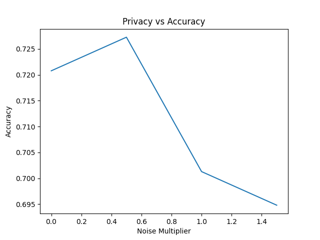

# Federated Learning with Differential Privacy for Healthcare

A research implementation comparing centralized training, federated learning (FedAvg), and differentially private federated learning on healthcare tabular data. Built to explore the **accuracy–privacy tradeoff** in distributed medical settings where raw data cannot leave client devices.

---

## Motivation

Healthcare data is sensitive by nature — hospitals and clinics cannot simply pool patient records for model training. Federated Learning allows multiple clients to collaboratively train a model without sharing raw data. Adding Differential Privacy provides **measurable, mathematical guarantees** (ε-DP) on how much information any single training run can leak.

This project benchmarks all three paradigms on the Pima Indians Diabetes dataset and quantifies the cost of privacy in terms of model accuracy.

---

## Project Structure

```
├── src/
│   ├── model.py              # Logistic regression model (PyTorch)
│   ├── client.py             # Local training with optional DP-SGD
│   ├── server.py             # FedAvg aggregation
│   ├── federated_train.py    # Federated training loop
│   ├── centralized_train.py  # Centralized baseline
│   ├── preprocess.py         # Standardization, stratified split, seeding
│   ├── data_loader.py        # CSV loader
│   └── privacy.py            # ε approximation from noise parameters
├── experiments.py            # Runs all comparisons, saves results + plot
├── results/
│   ├── experiment_results.csv
│   └── privacy_vs_accuracy.png
├── data/                     # Place dataset here (not committed)
├── requirements.txt
└── .gitignore
```

---

## Approach

### Model
Logistic regression implemented as a single linear layer in PyTorch (`nn.Linear → BCEWithLogitsLoss`). Intentionally simple — the focus is the training paradigm, not the model architecture.

### Federated Learning (FedAvg)
- Dataset split across `N` clients (IID sharding)
- Each round: clients receive global weights → train locally → return updated weights
- Server averages all client weights (Federated Averaging, McMahan et al. 2017)

### Differential Privacy (DP-SGD)
Applied at the client level during local training:
1. **Gradient clipping** — per `max_grad_norm` to bound sensitivity
2. **Gaussian noise injection** — scaled by `noise_multiplier × max_grad_norm`

The privacy budget ε is approximated as:

```
ε ≈ (sample_rate × √(2 × steps × ln(1/δ))) / noise_multiplier
```

A smaller ε means stronger privacy. Higher noise → smaller ε → lower accuracy.

---

## Results

| Method | Noise (σ) | ε (privacy budget) | Accuracy |
|---|---|---|---|
| Centralized | — | ∞ | ~76% |
| Federated (no DP) | 0.0 | ∞ | ~72% |
| Federated + DP | 0.5 | ~3.58 | ~72.7% |
| Federated + DP | 1.0 | ~1.79 | ~70.1% |
| Federated + DP | 1.5 | ~1.19 | ~69.5% |



**Key observation:** Mild noise (σ=0.5) slightly improves accuracy over no-DP federated — consistent with noise acting as implicit regularization. Beyond σ=1.0, the accuracy cost becomes significant (~2.5pp drop).

---

## Setup

### 1. Clone the repo
```bash
git clone https://github.com/vishu1618/federated-learning-dp-healthcare.git
cd federated-learning-dp-healthcare
```

### 2. Install dependencies
```bash
pip install -r requirements.txt
```

### 3. Get the dataset
Download the [Pima Indians Diabetes dataset](https://www.kaggle.com/datasets/uciml/pima-indians-diabetes-database) from Kaggle and place it at:
```
data/diabetes.csv
```

### 4. Run experiments
```bash
python experiments.py
```

Results will be saved to `results/experiment_results.csv` and `results/privacy_vs_accuracy.png`.

---

## Configuration

All hyperparameters are set at the top of `experiments.py`:

```python
ROUNDS = 20          # Federated communication rounds
LOCAL_EPOCHS = 5     # Local training epochs per round
NUM_CLIENTS = 5      # Number of simulated clients
NOISE_LEVELS = [0.0, 0.5, 1.0, 1.5]   # Noise multipliers to sweep
```

---

## Dependencies

```
torch
scikit-learn
pandas
numpy
matplotlib
```

---

## References

- McMahan et al. (2017) — [Communication-Efficient Learning of Deep Networks from Decentralized Data](https://arxiv.org/abs/1602.05629) (FedAvg)
- Abadi et al. (2016) — [Deep Learning with Differential Privacy](https://arxiv.org/abs/1607.00133) (DP-SGD)
- Dwork & Roth (2014) — [The Algorithmic Foundations of Differential Privacy](https://www.cis.upenn.edu/~aaroth/Papers/privacybook.pdf)

---

## Author

**Vishu Choudhary**  
B.Tech Computer Science & IT, KIET Group of Institutions (2023–2027)  
[GitHub](https://github.com/vishu1618) · [LinkedIn](https://linkedin.com/in/Vishu-Choudhary)
